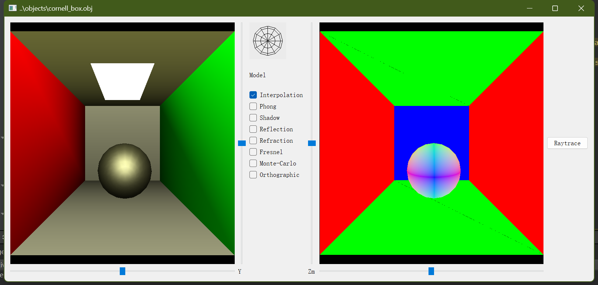
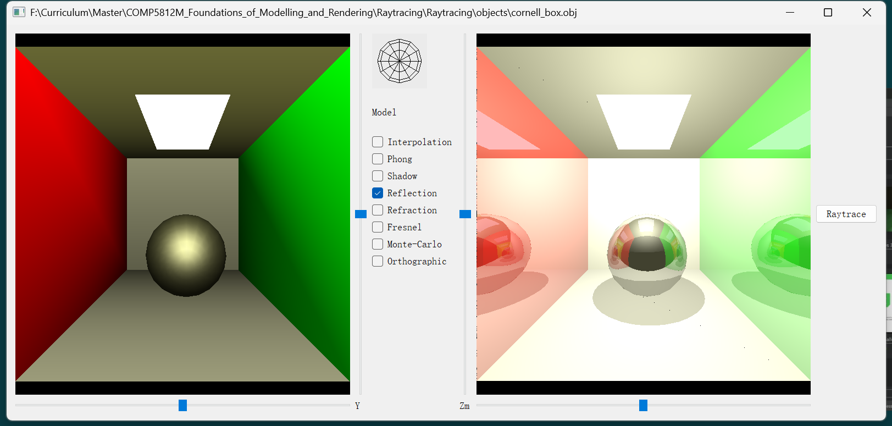
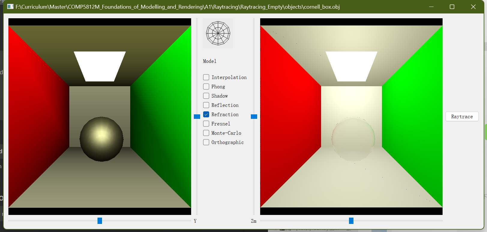
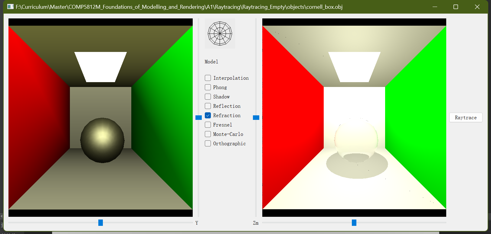

# Rasterisation 光栅化

不加载法线贴图时的法线可视化:

加载岩石法线贴图时的法线可视化:

根据高度切换贴图颜色+加载法线贴图:

显示三角网格:

# Raytracing 光线追踪

## Setup 环境配置和初始化

1. 下载QT及 QT Creater, 链接: https://www.qt.io/download-dev?hsLang=en
2. 安装过程注意选择 QT 5.13.0 或接近的稳定版本, 
3. 双击打开 Raytracing\RaytraceRenderWindow 路径下的 RaytraceRenderWindow.pro 文件
4. 在配置项目处, 选择 Desktop Qt 5.13.0 MinGW 32-bit (或其他版本), 勾选 Debug 和 Release, 点击Configure Project
5. 点击QT Creater左侧项目扳手图标, 在构建和运行处, 选择 Desktop Qt 5.13.0 MinGW 32-bit (或其他版本), 选择运行, 在Command line arguments处输入.obj文件和.mtl文件的路径(该文件在与RaytraceRenderWindow文件夹同级的objects文件夹中), 用空格隔开
6. 点击左侧绿色三角形按钮, 运行程序
7. 在出现的窗口中, 勾选中间选框, 点击右侧 Raytrace 按钮, 即可开始渲染光线追踪画面

## Functionality 已实现的按钮功能 

1. Interpolation: 显示法线
2. Phong: 光照模型
3. Shadow: 阴影
4. Reflection: 反射
5. Refraction: 折射
6. Fresnel: 菲涅尔效应
7. Monte Carlo: 蒙特卡洛采样
8. Orthographic: 正交投影

## ScreenShot 截图

显示法线方向:

左右两侧墙壁反射+球体反射+阴影:

透明物体折射+反射: 

透明物体折射+反射+阴影: 

# Contact Information 联系方式

- Email 邮箱: mickeymiao2023@163.com
- WeChat 微信: SiMiao1106
